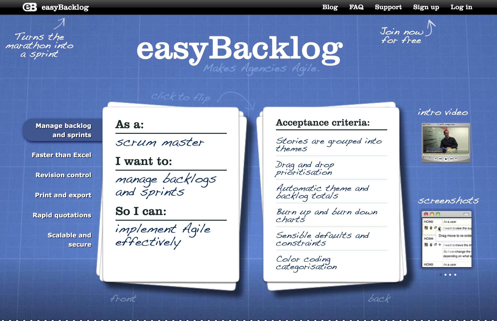

# easyBacklog

easyBacklog is an intuitive time saving backlog management tool for Agile practitioners working in or with agencies. It is designed to be not just another all purpose project management, Agile or collaboration tool for teams. It was a free service available to practitioners at easybacklog.com.

## Home page for posterity

# End of life: Q3 2022

The free easyBacklog.com service shut down on 30 September 2022. When [Matthew O'Riordan](https://mattheworiordan.com) started easyBacklog, his goals were modest and straightforward, he wanted to give people an intuitive time saving backlog management tool for Agile practitioners working in or with agencies. Before it shut, nearly 400k backlogs were created by more than 55k people.

easyBacklog was shut down because the project was neglected for many years. [Matthew O'Riordan](https://mattheworiordan.com) is running [Ably](https://ably.com), a business of 150 people that he founded to provide [serverless websockets](https://ably.com/topic/websockets) and [realtime collaborative APIs](https://ably.com/features) to developers. Ably as of 2022 powers realtime experiences for more than 300 million people each month.

# License (now open source)

This project has now been open sourced under the [MIT license](./LICENSE). Anyone is free to use this software and modify it as they see fit.

# Running this project

easyBacklog is built on [Ruby on Rails](https://rubyonrails.org/) and not been materially updated since 2015. As such, if you want to run this service it is strongly recommended you follow the upgrade path to a more modern verison of Rails.

Components:
* Ruby on Rails 3.2
* Postgres database
* JQuery and Backbone.js
* Devise for encryoption
* HAML and EJS for HAML/JST templates
* Sidekiq for background jobs
* [Ably for realtime collaboration](https://ably.com)